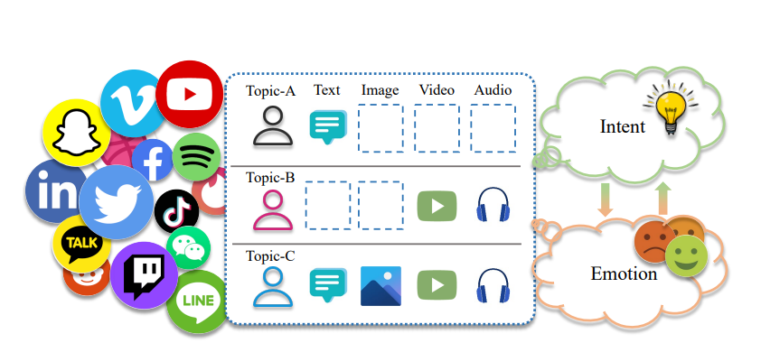
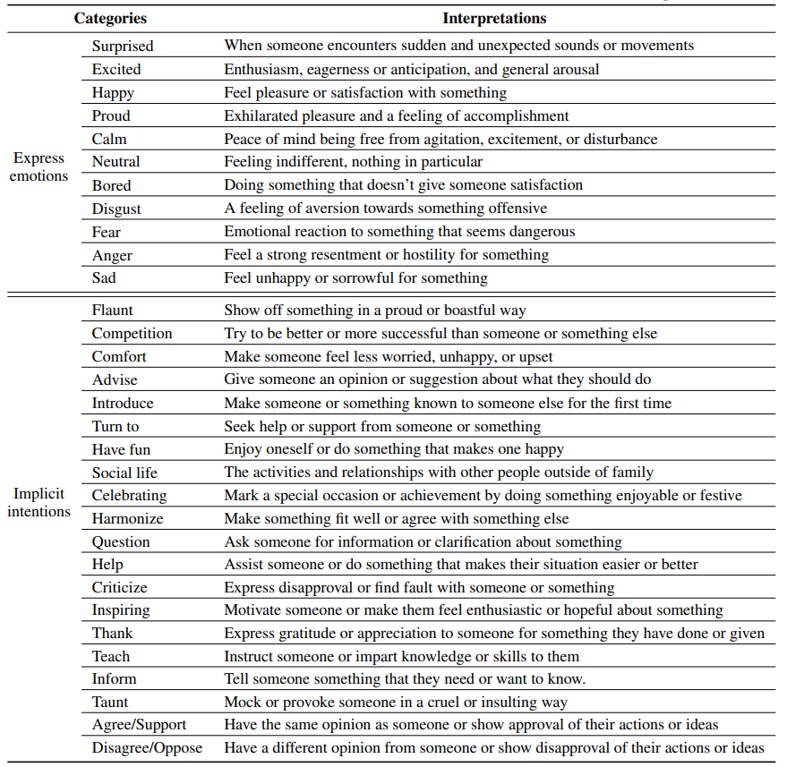

# MINE-dataset

This repo contains the official dataset and a unified framework for multimodal intention and emotion benchmarks of the research paper "MINE: Multimodal IntentioN and Emotion Understanding in the Wild".

## 1. Introduction

Intention and emotion are two essential factors that shape human social interactions, and understanding them is a key step towards achieving artificial general intelligence. However, existing works in the computer vision community have not explored the intrinsic connection between intention and emotion, nor do they examine the missing modality problem and topic diversity that exist in realistic social life. To address these gaps, we introduce a novel dataset, **M**ultimodal **I**ntentio**N** and **E**motion Understanding in the Wild (MINE), which provides high-quality labels of both intention and emotion for diverse and realistic user-generated data from social platforms. MINE consists of more than 20k topic-related tweets from Twitter, which include four common modalities in daily life: text, image, video, and audio. MINE is the first dataset that incorporates missing modality and multi-topic variations for intention and emotion understanding, which reflects the complexity and diversity of real-world situations. To facilitate future research on this task, we also provide a **benchmark** that compares different intention recognition methods. We show that these methods perform poorly on MINE, demonstrating its difficulty and highlighting its novelty for the community.

### An overview of Multimodal Intention and Emotion Understanding



## 2. Dataset Construction

The overall process of building the MINE dataset is shown below:

### a. Data sources

We collect raw data from twitter with keywords, 2019-2022. 
### Keywords(hashtags) in data collection


### b. Intention and emotion taxonomies

### Emotion and intention taxonomies of our MINE dataset with brief interpretations



### c. Multimodal Intention and Emotion Annotation

Our data annotation process consists of the following steps:

We divide our data into smaller batches, each containing about 1.5k samples.
We use the first batch to train two groups of annotators, to cross validate the accuracy of annotations. We have experts in these domains who review and provide feedback on the annotations of each sample in this batch to train the annotators.
For the subsequent batches, the two groups of annotators work independently, without seeing each other’s annotations. We measure the agreement between the two groups using a metric called differentiation, which is the percentage of samples that have different annotations from the two groups. For multi-categorized intention labels, we consider that having subsets is the result of annotation to reach a common understanding.
For the batches that have a differentiation higher than 20%, we involve the experts again to check and resolve the discrepancies between the two groups. The experts also give feedback to the annotators to improve their performance and consistency.
We repeat this process until we annotate all the batches and ensure that the differentiation of the entire data set is within 20%.


#### Dataset Statistics

| Item                                      | Statistics |
| ----------------------------------------- | ---------- |
| Number of intentions          | 20          |
| Number of emotions            | 11         |
| Number of text                          | 20044        |
| Number of images                  | 12428      |
| Number of videos        | 3895     |
| Number of audios | 1615      |
| Average length of text utterances         | 20.0       |
| Total number of words      |489069      |
| Average duration of videos (s)       | 24.4      |
| Total duration of videos (h)     | 21.9       |


## 3. Experiments

The text features are extracted by a pre-trained BERT language model. The image features are extracted with ViT. The video features are extracted with Video_Swin_Transformer. The audio features are extracted by wav2vec 2.0 on audio time series. The tools for extracting features can be found [here](./data_preprocess_code).

The multimodal intention and emotion benchmarks contain three powerful multimodal fusion methods: MISA, MulT and MFSA. 

## 4. Usage

### a. Acquire data

You can obtain the extracted feature and split files from [questionnaire](https://2j3zidpuszj.typeform.com/to/DZndMU9a) 

Dataset Description:

| Contents                       | Description                                                                                                                                                                                           |
| ------------------------------ | ----------------------------------------------------------------------------------------------------------------------------------------------------------------------------------------------------- |
| audio_data/audio_feats.pkl     | This directory includes the "audio_feats.pkl" file. It contains audio<br />feature tensors in each video segment.                                                                                     |
| audio_data/audio_feats.pkl     | This directory includes the "image_feats.pkl" file. It contains image<br />feature tensors.                                                                                     |
| audio_data/audio_feats.pkl     | This directory includes the "text_feats.pkl" file. It contains text<br />feature tensors.                                                                                     |
| video_data/video_feats.pkl     | This directory includes the "video_feats.pkl" file. It contains video<br />feature tensors for all keyframes in each video segment.                                                                   |
| train.tsv / dev.tsv / test.tsv | These files contain different split IDs and annotations.|

### b. Quick start

1. Use anaconda to create Python (version >=3.6) environment

   ```
   conda create --name MINE python=3.6
   conda activate MINE
   ```

2. Install PyTorch (Cuda version 11.2)

   ```
   conda install pytorch torchvision torchaudio cudatoolkit=11.2 -c pytorch
   ```

3. Clone the MINE-dataset repository.

   ```
   git clone https://github.com/yan9qu/MINE-dataset.git
   cd MINE-dataset
   ```


4. Run examples (Take MISA as an example)

   ```
   python run.py  --method MISA
   ```


## 5. Privacy protection and ethical issues

In order to prevent users’ willingness to object to the data being collected, we provid the [id numbers](./tweets_id.txt) of all collected tweets and provid a [questionnaire](https://2j3zidpuszj.typeform.com/to/jMNKxNT6). If your tweets are collected and you don’t want them to be shared, you can fill out the questionnaire and we will check and update the dataset regularly. Note: MINE only contains the features extracted from your tweets, not the original tweets.

## 6. Acknowledgements

Some of the codes in this repo are adapted from the following repos, and we are greatly thankful to them: [MIntRec](https://github.com/thuiar/MIntRec), [TalkNet](https://github.com/TaoRuijie/TalkNet-ASD), [SyncNet](https://github.com/joonson/syncnet_python).


